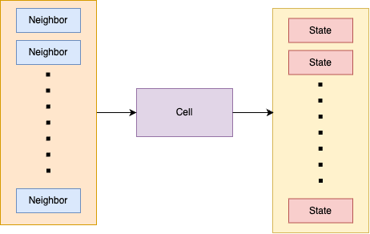

# Development Roadmap

## High-level Implementable Parts
1. Neural Cell
2. Grid of cells
3. Training mechanism
4. Display mechanism

## How should a cell be structured in regard to its encompassing grid?
All cells are identical in terms of decision making and only distinguished by the states of their surrounding neighbors.

In this system we will implement the underlying data structures on the scope of the grid and leave cells as views of a cell on the grid without being responsible for storing data.